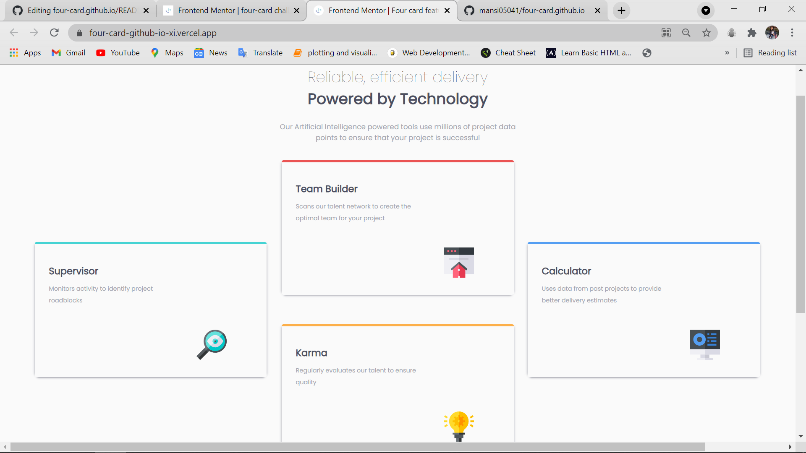

# Frontend Mentor - Four card feature section

This is a solution to the [Profit card challenge on Frontend Mentor](https://www.frontendmentor.io/challenges/four-card-feature-section-weK1eFYK/hub/fourcard-challenge-XsG6N3rNT). Frontend Mentor challenges help you improve your coding skills by building realistic projects. 

## Table of contents

- [Overview](#overview)
- [The challenge](#the-challenge)
- [Screenshot](#screenshot)
- [Links](#links)
- [My process](#my-process)
- [Built with](#built-with)
- [What I learned](#what-i-learned)
- [Continued development](#continued-development)
- [Useful resources](#useful-resources)
- [Author](#author)

## Overview
Completed challenge using Bootstrap-5

### The challenge

Users should be able to:

- View the optimal layout depending on their device's screen size

### Screenshot



### Links

- Solution URL: [https://github.com/mansi05041/four-card.github.io]
- Live Site URL: [https://four-card-github-io-xi.vercel.app/]

## My process

I use bootstrap for responsive part. 

### Built with

- Semantic HTML5 markup
- CSS custom properties
- Mobile-first workflow
- Bootstrap

### What I learned

```css
.col-lg-4{
padding: 3% 3% 2.5% 2% ;
box-shadow: 0 5px 5px -5px hsl(234, 12%, 34%),
            -5px 0 5px -5px hsl(229, 6%, 66%),
            5px 0 5px -5px hsl(229, 6%, 66%);
 border-radius: 1%;
}
```
I learn about box-shadow 


### Continued development

Still need improvement with allignment & responsive part

### Useful resources

- [Bootstrap](https://getbootstrap.com/) - This helped me in columns breakpoint & grid.

## Author

- Frontend Mentor - [@mansi05041](https://www.frontendmentor.io/profile/mansi05041)
- Linkedin - [mansi joshi](https://www.linkedin.com/in/mansi-joshi-663aa81a0/)


